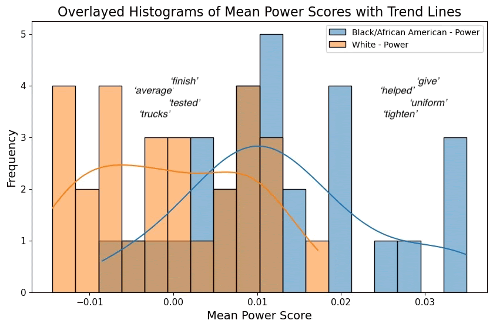
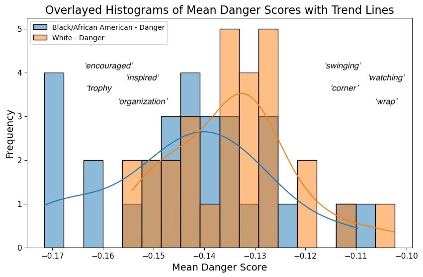

## NLP & Power & Danger in Young Adult Literature

**Project description:** This project was part of the University of Chicago's Data Science Clinic program, in partnership with the University of Northern Iowa. The Power-Danger Framework developed by Peter Dodds, et. al. scores words based on their general power (weak to strong) and danger (safe to dangerous). Applying this framework to novels by White and African American authors revealed linguistic patterns, some similar across author groups and some different. This project is important primarily because young adult literature can act as a mirror (of their own experiences) and a window (into the experiences of others) for young readers, influencing how they understand themselves and their society. This project also advocates for cross-disciplinary research by using data science tools such as Natural Language Processing to answer a humanities-based question.

### 1. Initial Data
- **Libraries**: `pandas`, `numpy`, `matplotlib`, `spacy`, `scipy`
- **Dataset**:
  - 29 Young Adult (YA) Newbery Award-winning novels by African American authors
  - 27 YA Newbery Award-winning novels by White authors

### 2. Framework and Methodology
- [Power-Danger Framework](https://pdodds.w3.uvm.edu/research/papers//years/2021/dodds2021b.pdf) by Dodds et. al.
  - argues meaning can be broken down into orthogonal dimensions: Power and Danger
- our analysis closely follows the methodology in Fudolig's [paper](https://www.nature.com/articles/s41599-023-01680-4)
  - applies the Power-Danger framework to books from Project Gutenberg

### 3. Pipeline Development
- our python-based pipeline deliverable can:
  - clean and tokenize a folder of raw txt files
  - apply power-danger scoring framework
  - return summarizing statistics and visualizations for each input novel

### 4. Data Visualization
- below visualizations are both for the novel *Darius & Twig* by Walter Dean Myers
- used Tableau to create two-dimensional histograms (in this specific context, named **ousiograms**) that summarize the distribution of meaning in a novel
- **time series** output by pipeline shows how power-danger scores fluctuate across narrative time
  - denoised using empirical mode decomposition & internal mode functions

### 5. Key Findings
- a bias towards weak-safe language across all novels
- shorter and longer novels showed similar evidence of narrative sub-arcs through power-danger fluctuations
- novels by African American authors trended with statistical significance towards **safe-powerful** language, suggesting an emphasis on resilience, empowerment, and community
- novels by White authors trended with statistical significance towards **dangerous-weak** language, suggesting an emphasis on external threats, isolation, and individual vulnerability

  
  

